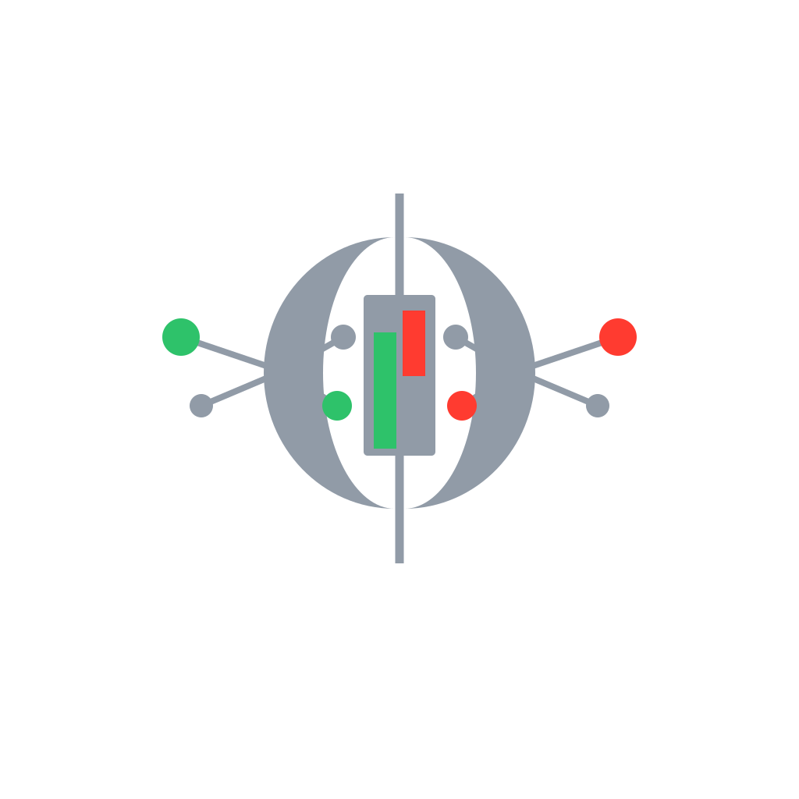

====================================================
 Download Crypto Currencies Data
====================================================

|pypi| |python| |license|

.. |pypi| image:: https://img.shields.io/pypi/v/dccd.svg
   :target: https://pypi.org/project/dccd/
   :alt: PyPI version

.. |python| image:: https://img.shields.io/pypi/pyversions/dccd.svg
   :alt: Python versions

.. |license| image:: https://img.shields.io/github/license/ArthurBernard/Download_Crypto_Currencies_Data.svg
   :alt: License

``dccd`` downloads crypto-currency data (OHLCV, trades, order book) from
multiple exchanges via REST and WebSocket APIs.

.. code-block:: bash

   pip install dccd

.. grid:: 3
   :gutter: 3

   .. grid-item-card:: Python API
      :link: quickstart
      :link-type: doc

      Historical REST downloads and real-time WebSocket streams — use
      ``dccd`` directly in your scripts or notebooks.

   .. grid-item-card:: CLI Daemon
      :link: daemon
      :link-type: doc

      Autonomous server-side collector driven by a YAML config with
      scheduling, WebSocket streams, and rclone remote sync.

   .. grid-item-card:: Storage & Formats
      :link: storage
      :link-type: doc

      Annual Parquet files by default · CSV · Excel · SQLite ·
      PostgreSQL · Polars & Pandas output.

.. rubric:: Key features

- **7 exchanges** — Binance, Coinbase, Kraken, Bybit, OKX, Bitfinex, Bitmex
- **3 data types** — OHLCV candles, trade history, order book snapshots
- **Incremental updates** — ``start='last'`` resumes from the last saved timestamp, no duplicates
- **Polars-native output** — ``get_data()`` returns a :class:`polars.DataFrame`; ``get_data(format='pandas')`` for Pandas
- **No API key required** — all endpoints used are public
- **Autonomous daemon** — YAML config, APScheduler, WebSocket streams, rclone remote sync

.. _supported-exchanges:

Supported exchanges
-------------------

.. list-table::
   :header-rows: 1
   :stub-columns: 1

   * - Exchange
     - REST OHLCV
     - REST Trades
     - REST Order Book
     - WS OHLCV
     - WS Trades
     - WS Order Book
   * - Binance
     - ✓
     - ✓
     - ✓
     -
     - ✓
     - ✓
   * - Coinbase
     - ✓
     - ✓ †
     - ✓
     -
     -
     -
   * - Kraken
     - ✓
     - ✓
     - ✓
     - ✓
     - ✓
     - ✓
   * - Bybit
     - ✓
     - ✓ †
     - ✓
     -
     - ✓
     - ✓
   * - OKX
     - ✓
     - ✓
     - ✓
     - ✓
     - ✓
     - ✓
   * - Bitfinex
     -
     -
     -
     - ✓ \*
     - ✓
     - ✓
   * - Bitmex
     -
     -
     -
     -
     - ✓
     - ✓

\* Bitfinex WS OHLCV is aggregated from the trades stream via :func:`~dccd.continuous_dl.bitfinex.get_ohlc_bitfinex`.

† Recent trades only (Bybit ≤ 1 000, Coinbase ≤ 100) — no deep historical pagination via the public REST API.

.. toctree::
   :hidden:
   :caption: Getting Started

   installation
   quickstart
   changelog

.. toctree::
   :hidden:
   :caption: Data Collection

   histo_dl
   continuous_dl
   daemon

.. toctree::
   :hidden:
   :caption: Reference

   storage
   models
   tools
   process_data
   cli
   configuration
