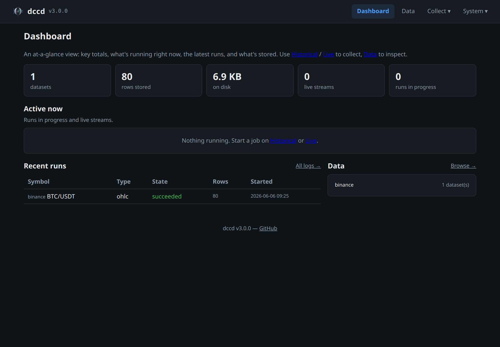

======
Web UI
======

dccd ships a small web UI — a dashboard to watch collection, browse stored data,
run backfills and control streams without touching the CLI. It is a **pure
client of the** :doc:`http-api`: every action is just an API call, so nothing is
hidden from scripting.

Running it
==========

.. code-block:: bash

   dccd ui                     # UI + API only (no scheduler)
   dccd start                  # full daemon: scheduler + streams + UI

   dccd ui --host 0.0.0.0 --port 8080

Both read ``settings.ui_host`` / ``ui_port`` from the config. Requires the extra:
``pip install "dccd[daemon,ui]"``. Then open ``http://127.0.0.1:8080``.

To protect it, set ``settings.ui_auth_token`` — the API then requires a bearer
token and the UI injects it automatically. For untrusted networks, keep the
default ``127.0.0.1`` bind and/or put it behind a reverse proxy.

Navigation
==========

A single top bar carries the brand (logo · ``dccd`` · version) on the left and
the navigation on the right. The nav groups pages by purpose: **Dashboard** and
**Data** are top-level, while **Collect ▾** (Historical, Live) and **System ▾**
(Logs, Config, Storage) are drop-down menus.

Dates are shown in the timezone set by ``settings.timezone`` (``local`` by
default; also ``UTC`` or any zoneinfo name such as ``Europe/Paris``). Relative
ages (“5 min ago”) are timezone-independent.

Pages
=====

.. list-table::
   :header-rows: 1
   :widths: 18 82

   * - Page
     - What it shows
   * - **Dashboard**
     - A KPI bar (datasets, rows stored, on-disk size, live streams, runs in progress), an *Active now* panel (running backfills with a live progress bar + live streams), recent runs, and a per-exchange data summary.
   * - **Data**
     - Read-only view of every dataset on disk under ``data_path`` — data-type tabs (OHLC / Trades / Order Book) → per-exchange accordions. Each row shows rows, time range, freshness dot, OHLC gap %, on-disk size, and file count. (Formerly *Inventory*; ``/inventory`` still redirects here.)
   * - **Historical**
     - Manage backfill jobs (**OHLC** and **Trades**): data-type tabs → per-exchange accordions → one row per dataset with an editable **first date**, a **Schedule** (Off / hourly / daily / custom — a recurring backfill run by the daemon), a real **coverage bar** (first date → today, reflecting stored data and holes), and inline **Run** / **Delete**. **Run all** (page header) and per-exchange **Run all** trigger every job at once. Order books have no REST history, so they live only on *Live*.
   * - **Live**
     - Manage streams (**Trades** and **Order Book**): same tabs/accordions, with a **liveness** indicator (last price/quote + freshness) per stream and inline **Start** / **Stop** / **Delete**. Order-book streams expose a *snapshot every N s* interval. (OHLC is collected on *Historical* via a Schedule, not streamed live.)
   * - **Config**
     - Edit ``settings`` / ``storage`` / ``alerts`` as a form (or the whole config as raw JSON) and save back to ``config.yml`` — validated server-side. Jobs are managed on Historical / Live (or the raw-JSON tab for bulk edits).
   * - **Logs**
     - Recent runs first (each with a human label and an expandable log tail), plus a live SSE console of whatever is running right now.
   * - **Storage**
     - On-disk dataset breakdown by exchange with sizes and file counts.

Running backfills & watching streams
====================================

On **Historical**, set a row's *first date* and click **Run** to fill the
missing history. The coverage bar turns live and updates by time covered (and
the row count) as the run progresses; **Run** becomes **Stop**, which cancels
cooperatively and keeps everything already collected. The default ``last`` start
uses a bounded look-back (short for trades) so a first click can't trigger a
runaway download.

On **Live**, the liveness column proves a stream is actually receiving data: a
coloured dot (green while data is arriving within the data's cadence, then amber,
then grey), the last value, and how long ago. It is seeded from the last
on-disk point, so a page refresh shows freshness immediately rather than
"waiting…"; the age reads as a relative "N min ago" for the last day and an
absolute date beyond, or the last-run date-time once a stream is stopped.

.. note::

   **Data** lists **all data on disk**, independent of your configured jobs
   (e.g. imported or migrated history). On **Historical**, datasets on disk that
   aren't tracked by a job are listed separately with a **+ Track** button to
   adopt them as a job.
